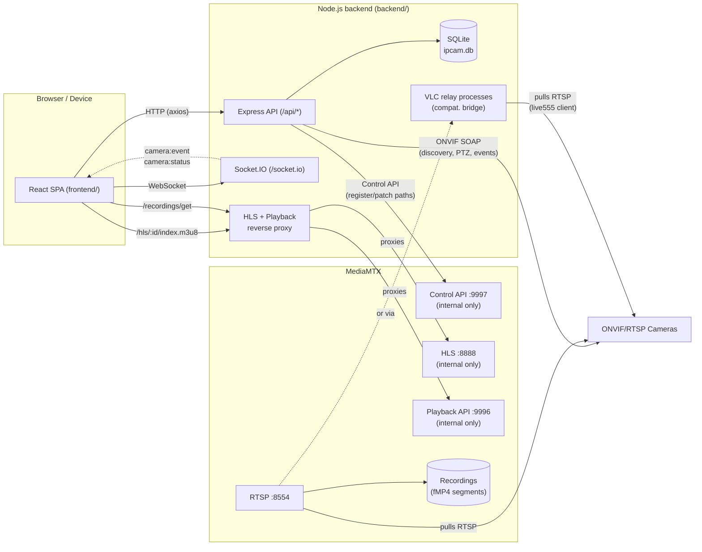

# Architecture

## Overview

## Components

### Backend (`backend/`)

- **Entry point**: [backend/src/index.ts](../backend/src/index.ts) — runs DB migrations, starts the HTTP server + Socket.IO, re-provisions every stored camera on boot, and runs a 60s reconciliation loop (see below).
- **App/router setup**: [backend/src/app.ts](../backend/src/app.ts) — mounts `/api`, the `/hls` and `/recordings` reverse proxies to MediaMTX, `/snapshots` static files, and (in production) the built frontend under `/web` with SPA fallback.
- **Database**: pure `better-sqlite3`, no ORM. Migrations are a plain array of SQL statements run on boot ([backend/src/db/client.ts](../backend/src/db/client.ts)), plus an idempotent `ALTER TABLE ADD COLUMN` step for additive schema changes (SQLite has no `ADD COLUMN IF NOT EXISTS`).
- **ONVIF layer** (`backend/src/onvif/`):
  - `device.ts` — connect, list media profiles, resolve RTSP URIs. Uses the `node-onvif` package (see [Troubleshooting](./troubleshooting.md) for why, not the `onvif` package, for this part).
  - `discovery.ts` — WS-Discovery probe on the LAN.
  - `ptz.ts` — continuous move / stop / presets.
  - `events.ts` — ONVIF PullPoint subscription for motion/tamper alerts. Uses the `onvif` (agsh) package, since `node-onvif` doesn't implement PullPoint conveniently.
  - `diagnose.ts` / `debugCommands.ts` — low-level SOAP diagnostics and a raw ONVIF command console, used by the "Debug ONVIF" page.
- **Media orchestration** (`backend/src/media/`):
  - `mediamtx.ts` — HTTP client for MediaMTX's Control API (register/patch/delete paths, read path status, list recording segments from the Playback API).
  - `provisioning.ts` — `provisionCamera()`: the single entry point that (re)resolves a camera's RTSP URI via ONVIF and (re)registers its MediaMTX path. Called on create/edit/restart/boot/reconciliation.
  - `vlcRelay.ts` — spawns a headless VLC (`cvlc`) process per camera flagged with `rtspCompatMode: "vlc-relay"`, to bridge cameras whose RTSP server is incompatible with MediaMTX's Go RTSP client (see [Troubleshooting](./troubleshooting.md)).
  - `motionRecording.ts` — in-memory per-camera cooldown timers implementing "record for N seconds after the last motion event" for cameras in `recordingMode: "motion"`.
  - `recorder.ts` — ffmpeg helpers (used for snapshots/thumbnails; MediaMTX itself does the actual stream recording natively).
- **Notifications** (`backend/src/notifications/`): `webhooks.ts` orchestrates sending on camera events; `discord.ts`, `telegram.ts`, `genericWebhook.ts`, `email.ts` are the per-channel senders (each independently optional). `notificationSettings.ts` persists the runtime-editable configuration for all four channels in the database (takes precedence over the env-var defaults), backing the **Configurações** page and `api/routes/settings.routes.ts`.
- **Scheduled jobs** (`backend/src/jobs/`): `retentionCleanup.ts` deletes event rows + snapshot files older than each camera's `retentionDays`, once daily plus once ~1 minute after boot (recordings themselves are deleted by MediaMTX's own per-camera `recordDeleteAfter`, set in `provisioning.ts`).
- **System stats** (`backend/src/lib/systemStats.ts`): CPU (background-sampled from `os.cpus()` deltas every 2s, non-blocking), memory (`os.totalmem/freemem`), and disk usage (`fs.statfs` on `RECORDINGS_DIR`/`DATA_DIR`) for the host running the backend - no external dependency. Exposed via `GET /api/system/stats` (`api/routes/system.routes.ts`), backing the Dashboard page and the always-visible `TopStatusBar`.
- **WebSocket**: `backend/src/ws/index.ts` (Socket.IO) broadcasts `camera:status` and `camera:event` to all connected clients (no per-room targeting).

### Frontend (`frontend/`)

- **Routing**: `react-router-dom`. All pages live under a shared `AppLayout` (sidebar nav) **except** `/g/:id`, the custom-grid kiosk view, which is deliberately a bare route with no navigation chrome.
- **Data fetching**: `@tanstack/react-query` + `axios` ([frontend/src/api/client.ts](../frontend/src/api/client.ts)), one hook module per backend resource (`cameras.ts`, `events.ts`, `grids.ts`, `ptz.ts`, `recordings.ts`, `onvifDebug.ts`).
- **Real-time**: `socket.io-client` ([frontend/src/api/socket.ts](../frontend/src/api/socket.ts)); `EventSocketListener` (mounted once in `AppLayout`) listens for `camera:event` and triggers a toast + a green flash around the camera's tile.
- **Always-visible status bar**: `TopStatusBar` ([frontend/src/components/layout/TopStatusBar.tsx](../frontend/src/components/layout/TopStatusBar.tsx)), mounted in `AppLayout` above the sidebar/content split, polls `GET /api/system/stats` every 5s and shows a compact CPU/memory/disk summary on every screen that has the sidebar (same scope as the nav, excluding the kiosk `/g/:id` view).
- **State**: lightweight `zustand` stores for toasts (`toastStore.ts`), UI state (`uiStore.ts`), and the flashing-camera-on-event set (`cameraEventStore.ts`).
- **Styling**: Tailwind CSS v4 via the `@tailwindcss/vite` plugin (no separate `tailwind.config.js`/PostCSS setup needed).
- **Pages**: `GridPage`, `CustomGridViewPage`, `TimelinePage`, `EventsPage`, `CamerasPage`, `OnvifDebugPage`, `SettingsPage`, `DashboardPage` — see [Features](./features.md) for what each does.

### MediaMTX

MediaMTX ([mediamtx.yml](../backend/mediamtx.yml)) is the streaming engine: it pulls RTSP from cameras, republishes as HLS/WebRTC, and records natively to disk (fMP4 segments) with its own retention (`recordDeleteAfter`, set **per-camera** from that camera's `retentionDays` on every provision - see `media/provisioning.ts` - not just the global default in `mediamtx.yml`). The backend only *orchestrates* it over its Control API — it never touches video bytes itself (except ffmpeg for snapshots).

Important operational detail: paths registered via the Control API (`POST /v3/config/paths/replace/{name}`) live **only in memory**. If the MediaMTX process/container restarts, every registered camera path is lost even though the backend and SQLite still think the camera is fine. The backend compensates for this (see "self-healing" below).

### Self-healing reconciliation loop

`backend/src/index.ts` runs a `setInterval` every 60s that, for every stored camera:
1. Re-registers the MediaMTX path if it's missing entirely (MediaMTX restarted).
2. Forces a full re-provision (which also restarts any VLC relay) if the path has been configured-but-not-`ready` for more than 3 minutes straight (a stuck/hung source connection).

This means recovering from a MediaMTX crash or a flaky camera generally requires no manual action — clicking "Reiniciar" (restart) on a camera in the UI just forces this same logic immediately instead of waiting for the next tick.

## Data flow: adding and watching a camera

1. **Discover** (optional): frontend calls `POST /api/discovery` → WS-Discovery probe → list of ONVIF devices on the LAN.
2. **Probe**: frontend calls `POST /api/onvif/probe` with an ONVIF URL or host/credentials → backend connects via ONVIF and returns every media profile's resolved RTSP URI (main/sub stream candidates), without persisting anything.
3. **Create**: frontend calls `POST /api/cameras` with the chosen streams → camera row is created in SQLite (always succeeds) → `provisionCamera()` runs best-effort (registers the MediaMTX path with credentials injected into the RTSP URL, `rtspTransport: tcp`, `sourceOnDemand: false`) → camera's `status` reflects the outcome (`online`/`offline`).
4. **Watch**: frontend renders `<video>` pointed at `/hls/<cameraId>/index.m3u8`, which the backend reverse-proxies to MediaMTX's HLS server (rewriting MediaMTX's cookie-check redirect to keep the `/hls` prefix).
5. **Record**: if `recordingMode` is `continuous`, the MediaMTX path was registered with `record: true` from the start. If `motion`, recording is toggled on/off reactively by `motionRecording.ts` in response to ONVIF events, with a cooldown buffer.
6. **Events**: if `motionRecording` (the boolean alert toggle) is enabled, `startEventListener()` subscribes to the camera's ONVIF PullPoint; each event is inserted into the `events` table, broadcast over WebSocket, and (if configured) sent to Discord/Telegram.
