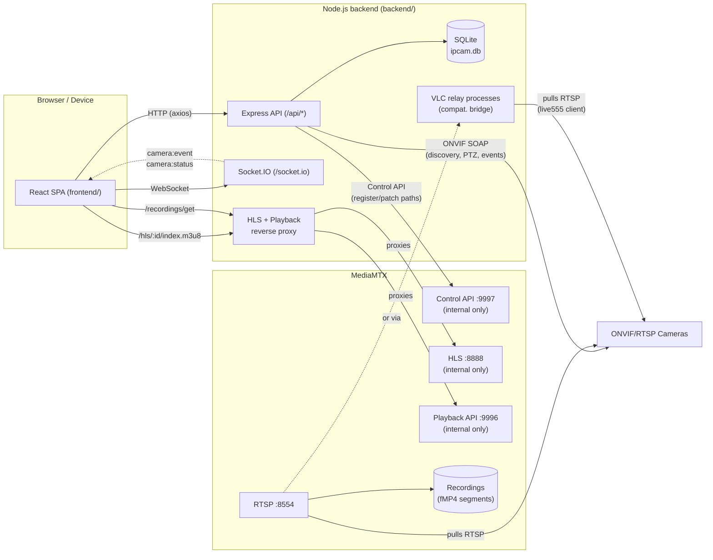

# Architecture

## Overview

## Components

### Backend (`backend/`)

- **Entry point**: [backend/src/index.ts](../backend/src/index.ts) — runs DB migrations, starts the HTTP server + Socket.IO, re-provisions every stored camera on boot, and runs a 60s reconciliation loop (see below).
- **App/router setup**: [backend/src/app.ts](../backend/src/app.ts) — mounts `/api`, the `/hls` and `/recordings` reverse proxies to MediaMTX, `/snapshots` static files, and (in production) the built frontend under `/web` with SPA fallback.
- **Database**: pure `better-sqlite3`, no ORM. Migrations are a plain array of SQL statements run on boot ([backend/src/db/client.ts](../backend/src/db/client.ts)), plus an idempotent `ALTER TABLE ADD COLUMN` step for additive schema changes (SQLite has no `ADD COLUMN IF NOT EXISTS`).
- **ONVIF layer** (`backend/src/onvif/`):
  - `device.ts` — connect, list media profiles, resolve RTSP URIs. Uses the `node-onvif` package (see [Troubleshooting](./troubleshooting.md) for why, not the `onvif` package, for this part).
  - `discovery.ts` — WS-Discovery probe on the LAN.
  - `ptz.ts` — continuous move / stop / presets.
  - `events.ts` — ONVIF PullPoint subscription for motion/tamper alerts. Uses the `onvif` (agsh) package, since `node-onvif` doesn't implement PullPoint conveniently.
  - `diagnose.ts` / `debugCommands.ts` — low-level SOAP diagnostics and a raw ONVIF command console, used by the "Debug ONVIF" page.
- **Media orchestration** (`backend/src/media/`):
  - `mediamtx.ts` — HTTP client for MediaMTX's Control API (register/patch/delete paths, read path status, list recording segments from the Playback API).
  - `provisioning.ts` — `provisionCamera()`: the single entry point that (re)resolves a camera's video source and (re)registers its MediaMTX path. For `sourceType: "onvif"`, resolves the RTSP URI via ONVIF first; for direct source types (`rtsp`/`rtmp`/`hls`/`srt`), registers the entered URL as-is; for `mjpeg-http`/`webpage`, registers the path in `publisher` mode and starts the matching bridge process below. Called on create/edit/restart/boot/reconciliation.
  - `vlcRelay.ts` — spawns a headless VLC (`cvlc`) process per camera flagged with `rtspCompatMode: "vlc-relay"`, to bridge cameras whose RTSP server is incompatible with MediaMTX's Go RTSP client (see [Troubleshooting](./troubleshooting.md)).
  - `mjpegBridge.ts` — ffmpeg process that re-encodes an MJPEG-over-HTTP source (`sourceType: "mjpeg-http"`) and *pushes* it into MediaMTX as a publisher (MediaMTX has no MJPEG input support).
  - `webpageBridge.ts` — headless Chromium (via `playwright-core`, pointed at the Alpine image's system Chromium binary to avoid bundling a second one) screenshotting a web page at a low frame rate, piped into ffmpeg and pushed into MediaMTX as a publisher (`sourceType: "webpage"`).
  - `rotationBridge.ts` — ffmpeg transcode bridge applying a `transpose` filter for cameras with a non-zero `rotation` (90/180/270), for source types that don't already have their own ffmpeg bridge (onvif/rtsp/rtmp/hls/srt); mjpeg-http/webpage bake the same filter into their existing bridge instead.
  - `motionOrchestrator.ts` — decides, per camera, whether to start an ONVIF PullPoint listener (`onvif/events.ts`) or the local video-based detector (`motionDetector.ts`, OpenCV via `backend/motion_worker.py`) based on `motionDetectionSource`, and starts/stops/restarts the right one on create/edit/enable/disable/boot.
  - `motionRecording.ts` — in-memory per-camera cooldown timers implementing "record for N seconds after the last motion event" for cameras in `recordingMode: "motion"`.
  - `recorder.ts` — ffmpeg helpers (used for snapshots/thumbnails; MediaMTX itself does the actual stream recording natively).
- **Notifications** (`backend/src/notifications/`): `webhooks.ts` orchestrates sending on camera events and connectivity changes (`notifyCameraUnavailable`/`notifyCameraRecovered`, called from the reconciliation loop below); `discord.ts`, `telegram.ts`, `genericWebhook.ts`, `email.ts` are the per-channel senders (each independently optional). `lib/webPush.ts` is a fifth channel (browser/PWA push, VAPID-based, key pair auto-generated and persisted in the database). `notificationSettings.ts` persists the runtime-editable configuration for all channels in the database (takes precedence over the env-var defaults), backing the **Configurações** page and `api/routes/settings.routes.ts`.
- **Scheduled jobs** (`backend/src/jobs/`): `retentionCleanup.ts` deletes event rows + snapshot files older than each camera's `retentionDays`, once daily plus once ~1 minute after boot (recordings themselves are deleted by MediaMTX's own per-camera `recordDeleteAfter`, set in `provisioning.ts`).
- **System stats** (`backend/src/lib/systemStats.ts`): CPU (background-sampled from `os.cpus()` deltas every 2s, non-blocking), memory (`os.totalmem/freemem`), and disk usage (`fs.statfs` on `RECORDINGS_DIR`/`DATA_DIR`) for the host running the backend - no external dependency. Exposed via `GET /api/system/stats` (`api/routes/system.routes.ts`), backing the Dashboard page and the always-visible `TopStatusBar`.
- **WebSocket**: `backend/src/ws/index.ts` (Socket.IO) broadcasts `camera:status` and `camera:event` to all connected clients (no per-room targeting).

### Frontend (`frontend/`)

- **Routing**: `react-router-dom`. All pages live under a shared `AppLayout` (sidebar nav) **except** `/g/:id`, the custom-grid kiosk view, which is deliberately a bare route with no navigation chrome.
- **Data fetching**: `@tanstack/react-query` + `axios` ([frontend/src/api/client.ts](../frontend/src/api/client.ts)), one hook module per backend resource (`cameras.ts`, `events.ts`, `grids.ts`, `ptz.ts`, `recordings.ts`, `onvifDebug.ts`).
- **Real-time**: `socket.io-client` ([frontend/src/api/socket.ts](../frontend/src/api/socket.ts)); `EventSocketListener` (mounted once in `AppLayout`) listens for `camera:event` and triggers a toast + a green flash around the camera's tile.
- **Always-visible status bar**: `TopStatusBar` ([frontend/src/components/layout/TopStatusBar.tsx](../frontend/src/components/layout/TopStatusBar.tsx)), mounted in `AppLayout` above the sidebar/content split, polls `GET /api/system/stats` every 5s and shows a compact CPU/memory/disk summary on every screen that has the sidebar (same scope as the nav, excluding the kiosk `/g/:id` view).
- **State**: lightweight `zustand` stores for toasts (`toastStore.ts`), UI state (`uiStore.ts`), and the flashing-camera-on-event set (`cameraEventStore.ts`).
- **Styling**: Tailwind CSS v4 via the `@tailwindcss/vite` plugin (no separate `tailwind.config.js`/PostCSS setup needed).
- **Pages**: `GridPage`, `CustomGridViewPage`, `TimelinePage`, `EventsPage`, `CamerasPage`, `OnvifDebugPage`, `SettingsPage`, `MaintenancePage`, `DashboardPage` (implemented but currently not routed - see [Features → Dashboard](./features.md#dashboard--system-stats)) — see [Features](./features.md) for what each does.

### MediaMTX

MediaMTX ([mediamtx.yml](../backend/mediamtx.yml)) is the streaming engine: it pulls RTSP from cameras, republishes as HLS/WebRTC, and records natively to disk (fMP4 segments) with its own retention (`recordDeleteAfter`, set **per-camera** from that camera's `retentionDays` on every provision - see `media/provisioning.ts` - not just the global default in `mediamtx.yml`). The backend only *orchestrates* it over its Control API — it never touches video bytes itself (except ffmpeg for snapshots).

Important operational detail: paths registered via the Control API (`POST /v3/config/paths/replace/{name}`) live **only in memory**. If the MediaMTX process/container restarts, every registered camera path is lost even though the backend and SQLite still think the camera is fine. The backend compensates for this (see "self-healing" below).

### Self-healing reconciliation loop

`backend/src/index.ts` runs a `setInterval` every **15 seconds** (`RECONCILE_INTERVAL_MS`) that, for every stored (and enabled) camera:
1. Re-registers the MediaMTX path if it's missing entirely (MediaMTX restarted).
2. Forces a full re-provision (which also restarts any VLC relay or ffmpeg/Chromium bridge) if the path has been configured-but-not-flowing for more than **45 seconds** straight (`STUCK_THRESHOLD_MS`) - "flowing" requires both `ready: true` *and* actual byte-count growth since the previous check, not just `ready` alone, since a wedged VLC relay (process still alive, but no longer actually relaying frames) can keep reporting `ready: true` for a while with zero new bytes.

This means recovering from a MediaMTX crash or a flaky/wedged camera generally requires no manual action — clicking "Reiniciar" (restart) on a camera in the UI just forces this same logic immediately instead of waiting for the next tick.

A second, longer-horizon timer tracks **prolonged** outages independently of the retry logic above (a `downSince` map, only cleared once the camera is actually flowing again - unlike the retry logic's own tracking, which resets on every forced re-provision attempt so it doesn't matter how many retries happened in between). If a camera has been down for **10 minutes** (`UNAVAILABLE_NOTIFY_THRESHOLD_MS`), it triggers a "camera unavailable" notification through every configured channel (Discord/Telegram/webhook/email/push - see [Features → Camera connectivity notifications](./features.md#motiontamper-events--alerts)), repeated every **60 minutes** (`UNAVAILABLE_NOTIFY_REPEAT_MS`) for as long as it stays down, and a "camera recovered" notification once it comes back (only if an "unavailable" notification was actually sent - avoids a spurious "recovered" message for blips that never crossed the 10-minute threshold).

## Data flow: adding and watching a camera

1. **Discover** (optional): frontend calls `POST /api/discovery` (WS-Discovery) or `POST /api/discovery/scan` (active TCP range scan) → list of ONVIF/RTSP devices on the LAN.
2. **Probe** (ONVIF cameras only - direct source types below skip straight to step 3 with a pasted URL): frontend calls `POST /api/onvif/probe` with an ONVIF URL or host/credentials → backend connects via ONVIF and returns every media profile's resolved RTSP URI (main/sub stream candidates), without persisting anything. When editing an already-saved camera, `POST /api/cameras/:id/probe` does the same but falls back to that camera's already-stored credentials for any field not explicitly overridden, so re-probing doesn't require retyping the password.
3. **Create**: frontend calls `POST /api/cameras` with the chosen streams (or a direct URL + `sourceType`) → camera row is created in SQLite (always succeeds) → `provisionCamera()` runs best-effort: for `onvif`/`rtsp`/`rtmp`/`hls`/`srt` it registers the MediaMTX path directly (credentials injected into the URL for onvif/rtsp, `rtspTransport: tcp`, `sourceOnDemand: false`); for `mjpeg-http`/`webpage` it registers the path in `publisher` mode and starts the matching ffmpeg/Chromium bridge, which then pushes video into that path itself. Camera's `status` reflects the outcome (`online`/`offline`).
4. **Watch**: frontend renders `<video>` pointed at `/hls/<cameraId>/index.m3u8`, which the backend reverse-proxies to MediaMTX's HLS server (rewriting MediaMTX's cookie-check redirect to keep the `/hls` prefix).
5. **Record**: if `recordingMode` is `continuous`, the MediaMTX path was registered with `record: true` from the start. If `motion`, recording is toggled on/off reactively by `motionRecording.ts` in response to motion events (ONVIF or video-based), with a cooldown buffer.
6. **Events**: if `motionRecording` (the boolean alert toggle) is enabled, `motionOrchestrator.ts` starts either the ONVIF PullPoint listener or the local video-based detector, per `motionDetectionSource`; each event is inserted into the `events` table, broadcast over WebSocket, and (if configured) sent to Discord/Telegram/webhook/email/push.
