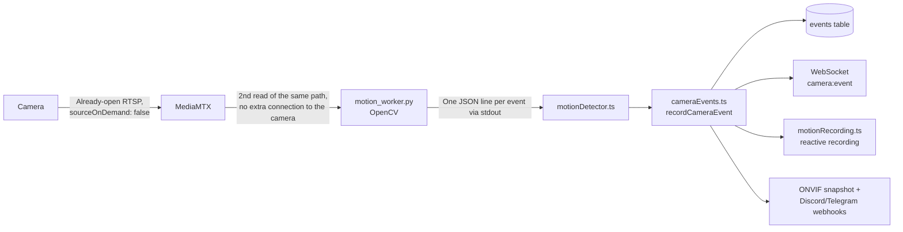

# Video-based motion detection (OpenCV)

## Context

This server supports two "motion" signal sources per camera (field
`motionDetectionSource`, values `"onvif"` or `"video"`):

- **`onvif`** (default): subscribes to the camera's own ONVIF PullPoint
  events (see [`backend/src/onvif/events.ts`](../backend/src/onvif/events.ts)
  and
  [`backend/src/onvif/pullPointEvents.ts`](../backend/src/onvif/pullPointEvents.ts)).
- **`video`**: runs a motion detector on the server itself, analyzing the
  video stream via OpenCV. This exists because some cheap/OEM cameras
  advertise ONVIF event support (`WSPullPointSupport: true` in
  `GetCapabilities`) but **don't actually implement the Events service in
  practice** — any Events SOAP request drops the TCP connection, even with
  correct authentication and using the `onvif` library's own implementation
  (tested exhaustively against real cameras in this environment; see notes
  in `/memories/repo/onvif-events-pullpoint.md`).

## Why we don't use ONVIF Events for these cameras

Shinobi and AgentDVR can "listen to events" on these same cameras, but it's
almost certainly **not via ONVIF PullPoint** — the most likely mechanism is
exactly this: server-side video analysis (it's AgentDVR's default method
and one of Shinobi's detection plugins), independent of the quality of the
camera's ONVIF implementation.

## Pipeline

Important: the detector **does not open a second connection directly to
the camera** — it reads `rtsp://mediamtx:8554/<cameraId>`, the same stream
MediaMTX already keeps connected at all times. This avoids issues with
cameras that only tolerate 1-2 simultaneous RTSP sessions (e.g. cameras
behind a VLC relay).

## Implementation

- [`backend/motion_worker.py`](../backend/motion_worker.py): standalone
  Python process, one per camera. Uses `cv2.VideoCapture` to read the RTSP
  stream, `cv2.createBackgroundSubtractorMOG2` (adaptive background model —
  handles gradual lighting changes well, unlike a simple diff against the
  previous frame) + `cv2.findContours` to find the largest moving blob's
  area. Runs the analysis at ~5fps (full frame rate isn't needed) on frames
  downscaled to 320px wide, to keep CPU cost low. Prints a JSON line
  (`{"type": "motion", "areaRatio": ...}`) to stdout whenever the largest
  contour's area exceeds 1% of the frame, with a 10s debounce between
  events.
- [`backend/src/media/motionDetector.ts`](../backend/src/media/motionDetector.ts):
  manages the Python process (spawn, automatic respawn on crash, parsing
  the JSON lines from stdout), same pattern used by the VLC relay
  (`media/vlcRelay.ts`).
- [`backend/src/events/cameraEvents.ts`](../backend/src/events/cameraEvents.ts):
  event pipeline shared between ONVIF and video sources — writes to the
  database, emits over WebSocket (green flash + toast on the frontend),
  triggers motion recording and snapshot capture/webhooks, regardless of
  which source generated the signal.
- [`backend/src/media/motionOrchestrator.ts`](../backend/src/media/motionOrchestrator.ts):
  decides which source to start/stop per camera (`onvif` vs `video`) based
  on `camera.motionDetectionSource`, called from `cameras.routes.ts`
  (create/edit/restart/delete camera) and from boot in `index.ts`.

## Dependencies / Docker image

`py3-opencv` (Alpine's own native package, **not** pip's `opencv-python`
wheel — manylinux wheels are glibc-based and won't run on musl/Alpine, and
building OpenCV from source would be too heavy) is installed in the
runtime stage of [`backend/Dockerfile`](../backend/Dockerfile) via `apk add
py3-opencv`, alongside the `ffmpeg`/`vlc` packages already in use.

## Tuning / false positives

The main false-positive source for this kind of detector is the day/night
switch (IR-cut turns on/off and the whole frame changes color). The
`MIN_AREA_RATIO` (1%) and the 5s "warm-up" period when opening the stream
(lets MOG2 learn the background before reporting anything) help mitigate
this but don't eliminate it completely — if recurring false positives show
up in that specific scenario, the core parameters all live at the top of
`motion_worker.py` (`MIN_AREA_RATIO`, `EVENT_DEBOUNCE_S`, `WARMUP_SECONDS`,
MOG2's `varThreshold`).

## Resources (hardware: Intel i5, 8GB RAM)

Each camera with `motionDetectionSource: "video"` runs a Python process
decoding a stream downscaled to 5fps/320px — CPU cost is dominated by
decoding (done by OpenCV/ffmpeg's own native code), the MOG2 analysis
itself is cheap at that resolution. For the current fleet (~6 cameras) this
runs comfortably alongside MediaMTX, VLC relays, and HLS remuxing already
active on the same host.
