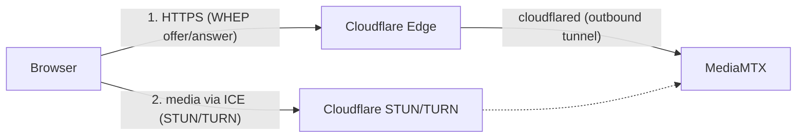

# Evaluated option: publishing streams on the web without port forwarding (WebRTC + Cloudflare)

> **Status: documented proposal/option, not implemented yet.** Nothing in
> this document exists today in `docker-compose.yml`/`mediamtx.yml` — this
> is a guide for when someone wants to expose the cameras outside the LAN
> without configuring port forwarding on the router.

## Problem

Today ([Deployment](./deployment.md)) the app is only meant for LAN use:
`docker-compose.yml` publishes `8554` (RTSP), `8889` (WebRTC, not used by
the player yet) and `4000` (backend) on the host. Reaching this from
outside home would require manual port forwarding on the router — which
the user wants to avoid.

## Why there's no "pure P2P" without any external service

WebRTC "P2P" here means the **browser connecting directly to MediaMTX**
(without a media server relaying the video at all times) — MediaMTX
already supports this natively via WHIP/WHEP (`webrtc: yes` in
[`mediamtx.yml`](../backend/mediamtx.yml)), it just needs to be
configured. The "no port forwarding" problem has two independent parts:

1. **Signaling** — the WHEP HTTP request (negotiating offer/answer) needs
   to reach the home network somehow.
2. **Media** — the video's RTP/UDP packets need to traverse the router's
   NAT.

Neither requires manually opening a port on the router if the right
components are used — but both depend on *some* intermediary running
outside the home network. This is inherent to NAT traversal in WebRTC, not
a limitation of this project.

## Proposed architecture

| Part | Component | Why it works without port forwarding |
|---|---|---|
| Signaling (WHEP) | **Cloudflare Tunnel** (`cloudflared`, new container) | Makes an **outbound** connection from inside the home network to Cloudflare's edge — no port is opened on the router. Produces a public hostname (e.g. `stream.yourdomain.com`) pointing to MediaMTX. |
| Media (RTP/UDP), direct path | **STUN** (`stun.cloudflare.com:3478`) | Enables "real P2P" when the router's NAT is cone-type (most residential routers, non-CGNAT) — the browser connects directly to MediaMTX's public IP:port, no relay. |
| Media, fallback | **TURN** (`turn.cloudflare.com`, managed service) | When STUN fails (CGNAT — common with mobile carriers/some fiber ISPs in Brazil — or symmetric NAT), traffic is relayed. MediaMTX only makes an **outbound** connection to TURN, again with no open port. |

**Self-hosting a TURN server (e.g. coturn) on the home network isn't
worth it**: a TURN server needs to genuinely accept inbound connections,
which would fall right back into the original port-forwarding problem.
That's why Cloudflare's managed TURN service (anycast network, no server
of your own to maintain) is the right piece here.

## Implementation (when it's done)

1. **`docker-compose.yml`**: new `cloudflared` service (image
   `cloudflare/cloudflared:latest`) with a tunnel pointing a public
   hostname to `http://mediamtx:8889` (WHEP) and, optionally, another
   hostname to `http://backend:4000` (full UI).
2. **`backend/mediamtx.yml`**: add `webrtcICEServers2` with Cloudflare's
   STUN (`stun:stun.cloudflare.com:3478`) and TURN credentials.
3. **Backend**: a periodic job (same pattern as the 60s reconciliation
   loop already in [`index.ts`](../backend/src/index.ts)) to generate
   temporary TURN credentials via the Cloudflare API (max TTL of 48h) and
   apply them via `PATCH` to MediaMTX's global config — credentials
   expire, so they can't just be hardcoded in `mediamtx.yml`.
4. **Security — mandatory before exposing publicly**: today the app
   **has no authentication at all** (see
   [Known limitations](./troubleshooting.md#known-limitations)). Putting
   **Cloudflare Access** in front of the tunnel hostname (Google/GitHub/OTP
   login, configured entirely in the Cloudflare dashboard, no code changes)
   is the minimum before publishing any camera to the internet.

## Costs (Cloudflare)

| Component | Cost |
|---|---|
| Cloudflare Tunnel (`cloudflared`) | Free (Cloudflare Zero Trust, free plan) |
| Cloudflare Access (login in front of the tunnel) | Free for up to 50 users/logins |
| STUN (`stun.cloudflare.com`) | Always free |
| TURN (`turn.cloudflare.com`, fallback only) | US$0.05/GB egress, with a **1,000 GB free tier per month** ([official pricing](https://developers.cloudflare.com/realtime/pricing/)) |
| Domain (required to route the tunnel) | Not a Cloudflare cost; ~US$10–15/year if you don't already own one |

For typical home use (a few people checking in occasionally), the expected
cost is **$0/month** in most cases: if the router's NAT allows a direct
STUN connection, TURN is never billed. Charges only occur if the ISP uses
CGNAT *and* the video is watched remotely for many hours every month — even
then it would be a low, non-prohibitive amount.

## Open items to make this real

- Create a Cloudflare account (free), add your own domain, create the
  tunnel and a TURN key (`calls turn_keys`) in the dashboard.
- Decide whether the public hostname exposes only the video (WHEP) or the
  whole app (`:4000`) behind Access.
- Confirm the exact syntax of `webrtcICEServers2` for the MediaMTX version
  in use (check the official MediaMTX documentation before applying it,
  field names can change between versions).
