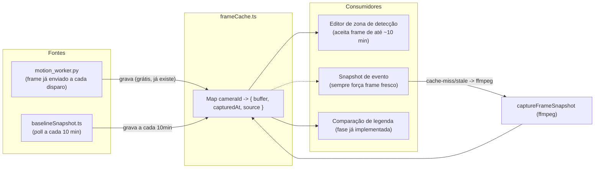

# 01 — Frame Cache (frame recente compartilhado por câmera)

> **Status: implementado**, com um ajuste em relação ao desenho original
> (ver seção "Passos concretos", item 3) e com as estatísticas do Dashboard
> também implementadas.

**Prioridade**: Alta · **Esforço**: M · **Depende de**: nada · **Bloqueia**: fases 02 e 03 (ambas se beneficiam de um frame já disponível em memória)

## Motivação

Da conversa com o ChatGPT: *"Nunca deixar a IA ler RTSP"* / *"FFmpeg → frame
compartilhado → todos os consumidores"*. Hoje isso é parcialmente verdade (a
IA de fato não lê RTSP — ver [00](./00-estado-atual-e-dores.md#2-motion_workerpy--vision_workerpy--modelos-de-concorrência-opostos)),
mas **cada consumidor de snapshot único ainda decodifica sozinho**, sem
nenhum cache. Isso é o ganho de CPU mais barato e mais isolado de todo o
roadmap — não exige tocar em IA, tracking ou UI.

## Estado atual (referências)

- `captureFrameSnapshot(cameraId)` sobe um ffmpeg novo a cada chamada
  ([frameSnapshot.ts#L21-L32](../backend/src/media/frameSnapshot.ts#L21)).
- Chamado por: fallback de snapshot de evento
  ([cameraEvents.ts](../backend/src/events/cameraEvents.ts)), endpoint de
  imagem de fundo do editor de zona de detecção
  (`GET /api/cameras/:id/snapshot`), e o refresh do baseline idle a cada 10
  minutos ([baselineSnapshot.ts#L15-L52](../backend/src/media/baselineSnapshot.ts#L15)).
- `motion_worker.py` já produz um JPEG (640px) a cada disparo de movimento e
  o envia via stdout — esse frame **já existe em memória no Node** no momento
  em que chega, mas hoje só é usado para a chamada de `classifyMotionFrame`;
  não é guardado em lugar nenhum para reuso.

## Desenho proposto

Um módulo novo, `backend/src/media/frameCache.ts`, com responsabilidade única:
manter o **último JPEG conhecido por câmera** em memória (`Map<cameraId,
{ buffer: Buffer; capturedAt: number; source: "motion" | "poll" }>`), e uma
função `getRecentFrame(cameraId, maxAgeMs)` que:

1. Se houver um frame em cache mais novo que `maxAgeMs`, retorna ele
   diretamente (sem I/O).
2. Caso contrário, cai para o `captureFrameSnapshot` existente (ffmpeg), e
   guarda o resultado no cache antes de retornar.

Alimentação do cache, duas fontes (sem novo processo dedicado):

- **Passiva/gratuita**: toda vez que `motion_worker.py` envia um frame de
  movimento, `motionDetector.ts` grava esse mesmo buffer no `frameCache`
  antes de repassar para classificação — zero custo adicional, é o mesmo
  buffer que já existe.
- **Ativa, mas throttled**: `baselineSnapshot.ts` continua chamando
  `captureFrameSnapshot` a cada 10 minutos (não muda), mas agora grava o
  resultado no `frameCache` com `source: "poll"` em vez de guardar só no seu
  próprio `Map` interno — o que permite que o endpoint do editor de zona e o
  fallback de snapshot de evento reaproveitem esse mesmo frame se ainda for
  "recente o suficiente" (ex.: `maxAgeMs` configurável por chamador — o
  editor de zona pode aceitar até 10 min de idade; um snapshot de evento
  real não deveria, e sempre força um `captureFrameSnapshot` fresco).

## Passos concretos

1. Criar `backend/src/media/frameCache.ts`: `Map` em memória +
   `getRecentFrame(cameraId, maxAgeMs)` + `setFrame(cameraId, buffer, source)`
   + `getFrame(cameraId)` (sem forçar captura, usado por health/debug).
2. `motionDetector.ts`: ao receber o evento `{"type": "motion", "frame": ...}`
   do Python, chamar `setFrame(camera.id, buffer, "motion")` antes de seguir
   para `classifyMotionFrame`.
3. `baselineSnapshot.ts`: **implementado com um ajuste em relação ao desenho
   original acima** — o `Map` interno de baseline foi **mantido separado**
   do `frameCache`, e apenas passa a *também* alimentar `setFrame(cameraId,
   buffer, "poll")` (além de continuar gravando em `baselines`). Motivo:
   `frameCache` guarda só o frame mais recente por câmera, de qualquer fonte
   (`motion` ou `poll`) — se um evento de movimento acontecer durante a
   janela de 10 min entre dois refreshes do baseline, o slot do
   `frameCache` fica com o frame do evento (fonte `"motion"`) até o próximo
   poll. Se `getBaselineSnapshot` lesse diretamente do `frameCache`, um
   evento subsequente nesse intervalo compararia a legenda contra o próprio
   frame do evento anterior (não contra a cena vazia), quebrando o
   propósito da comparação. Manter os dois Maps separados (um para "último
   frame de qualquer fonte", outro para "último frame comprovadamente
   idle") resolve isso sem custo extra.
4. Endpoint do editor de zona (`GET /api/cameras/:id/snapshot`): tentar
   `getRecentFrame(id, 10 * 60_000)` antes de cair no ffmpeg direto.
5. Fallback de snapshot de evento em `cameraEvents.ts`: manter o
   comportamento atual (sempre fresco) — **não** usar o cache aqui, já que um
   snapshot de evento precisa refletir o momento exato, não um frame de até
   10 minutos atrás. Documentar essa decisão no próprio código com um
   comentário curto.
6. Dashboard (`processHealth.ts`/`system.routes.ts`): opcionalmente expor
   `frameCache` stats (quantas câmeras têm frame válido, idade média) — baixo
   valor, pode ficar de fora do MVP desta fase.

## Critérios de aceite

- Nenhum novo processo de longa duração é criado (o cache é só um `Map` em
  memória no processo Node já existente).
- O editor de zona de detecção deixa de gerar um ffmpeg novo em toda
  navegação de câmeras quando já existe um frame recente.
- `baselineSnapshot.ts` não perde nenhuma garantia que já tem hoje (skip
  durante sessão de evento ativa continua intacto).
- Testes existentes (`npm test`) continuam passando; nenhum teste novo
  obrigatório, mas um teste unitário simples de `frameCache.ts`
  (get/set/expiração por idade) é desejável já que é lógica pura, fácil de
  testar sem mocks pesados.

## Riscos / trade-offs

- Cache em memória se perde em cada restart do backend — aceitável, mesmo
  comportamento de hoje (o `Map` do `baselineSnapshot.ts` já era assim).
- Se o editor de zona usar um frame "velho" (até 10 min), o usuário pode
  desenhar a zona sobre uma cena que já mudou levemente (ex.: mudança de luz
  do dia). Mitigação: manter um botão "atualizar imagem" no editor que força
  bypass do cache (chamando o endpoint com um parâmetro `?fresh=1`, opcional,
  não obrigatório para o MVP).
