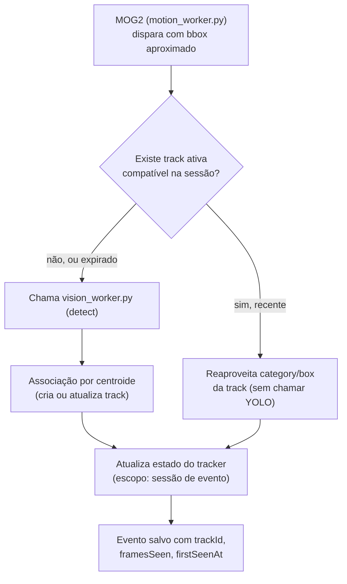

# 02 — Tracking de objetos (IDs persistentes entre frames)

> **Status: implementado.** Ver `backend/src/media/objectTracker.ts` +
> integração em `objectDetection.ts`/`motionDetector.ts`/`cameraEvents.ts`.
> Não implementado (fora do escopo/futuro): Kalman filter, UI mostrando
> "objeto visto por Xs".

**Prioridade**: Alta · **Esforço**: M · **Depende de**: nada tecnicamente, mas ganha muito valor combinado com a [Fase 01](./01-frame-cache.md) · **Bloqueia**: parte da [Fase 03](./03-stream-anotada-renderer.md) (overlay com ID estável)

## Motivação

Da conversa com o ChatGPT: *"Eu adicionaria: YOLO → ByteTrack → MOSSE. Assim
o YOLO roda a cada poucos frames."* Hoje (confirmado em
[00](./00-estado-atual-e-dores.md#3-detecções-nunca-voltam-para-o-vídeo-sem-tracking-sem-overlay))
cada disparo de movimento gera uma classificação **stateless** — sem memória
do objeto do disparo anterior. Consequência prática dupla:

1. **Custo**: se uma pessoa fica 20 segundos na cena e o MOG2 dispara 5 vezes
   nesse intervalo, o `vision_worker.py` (processo único, sequencial — ver
   [00](./00-estado-atual-e-dores.md#2-motion_workerpy--vision_workerpy--modelos-de-concorrência-opostos))
   roda o YOLO 5 vezes para, provavelmente, "descobrir" a mesma pessoa 5
   vezes.
2. **Qualidade de produto**: a legenda gerada pelo VLM (`captioning.ts`) e as
   notificações tratam cada disparo como um evento novo e desconectado — não
   há como saber "esta é a mesma pessoa que apareceu há 5 segundos" nem gerar
   um resumo tipo "pessoa permaneceu 20s no quintal".

## Estado atual (referências)

- `classifyMotionFrame` em `backend/src/media/objectDetection.ts` chama o
  `vision_worker.py` (task `detect`, opcionalmente `face`) uma vez por
  disparo de MOG2, sem qualquer estado entre chamadas.
- `ObjectDetection.box` já vem normalizado `[x, y, w, h]` do YOLO
  ([vision_worker.py#L169-L177](../backend/vision_worker.py#L169)) — a
  matéria-prima para tracking já existe, só falta a lógica de associação
  entre frames.
- Uma "sessão de evento" já existe conceitualmente
  (`activeSessions` em [cameraEvents.ts](../backend/src/events/cameraEvents.ts),
  exposta via `isEventSessionActive()`) — é o escopo temporal natural para o
  tracker viver (não precisa rastrear entre sessões diferentes).

## Desenho proposto

**Não** propomos ByteTrack/DeepSORT/BoT-SORT como redes/dependências extras,
nem MOSSE/KCF/CSRT (correlation trackers de pixel do `opencv-contrib`, que o
projeto evita propositalmente por licenciamento/tamanho — ver decisão de usar
só `cv2.dnn`/YuNet/SFace nativos). Uma segunda conversa com o ChatGPT
(`https://chatgpt.com/share/6a6f56da-1134-83e9-8fd1-cb353f2212b1`) detalhou
que **ByteTrack/DeepSORT/BoT-SORT também não são trackers de pixel** — são
algoritmos de *associação* entre detecções de frames consecutivos (Kalman
Filter para prever posição + Hungarian Algorithm para casar detecção↔track).
Para a escala do OpenDVR (uma câmera doméstica raramente tem mais que
alguns objetos simultâneos), a mesma conversa recomenda não usar Hungaro
nem Kalman de início — um **tracker de associação simples por score direto**
já resulta em tracking correto e barato o suficiente:

- Estado: `{ cameraId: { tracks: [{ id, box, category, lastSeenAt, framesSeen }] } }`.
- A cada novo `detect`, casa cada bounding box novo com a track existente que
  maximiza um score simples:
  $$\text{score} = 0.6 \cdot \text{IoU} + 0.3 \cdot \text{proximidade do centro} + 0.1 \cdot \text{similaridade de tamanho}$$
  (pesos exatos ajustáveis; a ideia central, citada literalmente na conversa,
  é *"0.6 IOU + 0.3 distância + 0.1 tamanho"*). Sem Hungarian Algorithm —
  para até ~50 objetos por câmera, escolher greedily a melhor track por
  detecção (maior score acima de um limiar mínimo) já é suficiente e é
  O(n·m) trivial. Cria track nova se não houver match acima do limiar; expira
  tracks sem match há mais de N segundos (alinhado ao fim da sessão de
  evento).
- **Otimização de custo, não só de qualidade**: se já existe uma track ativa
  e "recente" (viu o objeto há < X segundos) e a *posição aproximada* ainda
  bate com o motion bbox do MOG2 (heurística barata, sem rodar YOLO de novo),
  o `objectDetection.ts` pode **pular a chamada ao YOLO** e apenas atualizar
  `lastSeenAt`/`framesSeen` da track existente, reaproveitando `category`
  anterior. YOLO só roda de fato quando: (a) não há track compatível, ou (b)
  passou tempo suficiente desde a última confirmação real (ex. a cada 3-5
  disparos, para não "esquecer" se o objeto mudou).
- **Extensão futura opcional (fora do MVP desta fase)**: um filtro de Kalman
  simples por track (prevendo posição no próximo frame a partir da
  velocidade observada) reduziria ainda mais o custo de associação e
  melhoraria a suavidade do `trackId` entre disparos espaçados — citado na
  conversa como "quase obrigatório" para trackers de produção, mas
  dispensável no MVP dado que o OpenDVR já espaça as chamadas ao YOLO pelos
  disparos do MOG2, não por um pipeline de vídeo contínuo a N fps.
- Cada evento de banco passa a carregar `trackId` + `framesSeen` /
  `firstSeenAt` nos `pipelineOutputs.object_detection`, permitindo no futuro
  (fora de escopo desta fase) mostrar "objeto visto por 23s" na UI.

### Nota para capacidades futuras (LPR/placas, rosto): sempre recortar antes de rodar o modelo caro

Se no futuro o OpenDVR ganhar leitura de placa (LPR/OCR) ou expandir o
reconhecimento facial, a mesma conversa recomenda um padrão importante para
não explodir o custo de CPU: **nunca rodar OCR/face num frame inteiro** —
sempre recortar (crop) a região da `track` já classificada como `vehicle`
(para placa) ou `person` (para rosto) antes de rodar o modelo secundário.
Isso é uma otimização válida mesmo com o `vision_worker.py` atual (a task
`face` de hoje já roda YuNet no frame inteiro, mas um LPR futuro deve nascer
com recorte desde o início, não como retrofit). Similarmente, classificação
de animais **não precisa de um modelo dedicado** — o próprio YOLO/COCO já
distingue `dog`/`cat`/`horse`/`cow`/`bird` nas classes que hoje são
colapsadas em `animal` por `objectDetection.ts`; expor a classe específica em
vez de só a categoria agregada seria uma mudança pequena e de baixo custo,
não uma nova capacidade de IA.

## Onde vive o tracker: Node ou Python?

Recomendação: **Node** (`backend/src/media/objectTracker.ts`), não Python.
Motivos:
- O estado já é por-câmera-por-sessão, e a sessão (`activeSessions`) já vive
  no Node (`cameraEvents.ts`) — colocar o tracker lá evita duplicar esse
  conceito de sessão em dois lugares/duas linguagens.
- `vision_worker.py` é deliberadamente stateless/burro hoje (só recebe imagem,
  devolve detecção) — manter assim simplifica reinícios/crash-recovery dele
  sem perder estado de tracking.
- Lógica de centróide é trivial em TypeScript puro, sem necessidade de numpy.

## Passos concretos

1. Criar `backend/src/media/objectTracker.ts`: `updateTracks(cameraId,
   detections): { detections: DetectionWithTrackId[]; skippedYolo: boolean }`
   — API pura, testável sem mocks (entrada/saída determinística).
2. Integrar em `objectDetection.ts`: antes de chamar `classifyMotionFrame`,
   consultar o tracker para decidir se pula o YOLO (ver heurística acima).
3. Expirar tracks quando `isEventSessionActive(cameraId)` virar `false`
   (reaproveitar o mesmo hook que `baselineSnapshot.ts` já usa).
4. Adicionar `trackId`/`framesSeen`/`firstSeenAt` ao `pipelineOutputs`
   existente (`appendEventPipelineOutput`), sem quebrar o formato atual
   (campos adicionais, não substituição).
5. Testes unitários do tracker: cenário com 1 objeto se movendo pouco entre
   frames (deve manter o mesmo `trackId`), cenário com 2 objetos cruzando
   (não deve trocar IDs), cenário de expiração por timeout.
6. **Não** expor UI nova nesta fase — isso é matéria-prima para a Fase 03 e
   para features futuras (ex. "tempo de permanência"), mas o valor de custo
   (menos chamadas ao YOLO) já se paga sozinho sem UI.

## Critérios de aceite

- Redução mensurável de chamadas a `vision_worker.py` em uma sessão de
  evento com múltiplos disparos MOG2 do mesmo objeto parado/lento (medir via
  log/contador antes/depois).
- Nenhuma regressão na taxa de detecção (objetos genuinamente novos ainda são
  classificados corretamente; a heurística de "pular YOLO" deve favorecer
  falso-negativo raro sobre custo, mas nunca "esquecer" por mais que alguns
  disparos seguidos).
- `npm test` do backend continua passando + novos testes do tracker.

## Riscos / trade-offs

- Um tracker por centróide é simples e pode confundir objetos que se cruzam
  ou objetos muito parecidos próximos um do outro — aceitável para o caso de
  uso (doméstico/pequeno comércio), não é vigilância crítica.
- Pular o YOLO com base em heurística de posição pode, em casos raros, deixar
  de perceber que o objeto mudou de categoria (ex. pessoa que solta uma
  bicicleta). Mitigação: forçar reclassificação real a cada N disparos
  mesmo com track "válida" (parâmetro configurável, ex. a cada 3).
