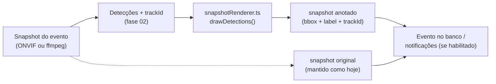
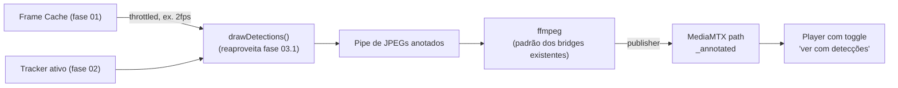

# 03 — Stream anotada / Renderer (overlay de bounding boxes)

> **Status: Entregável 1 (snapshot anotado) implementado.** Ver
> `backend/src/media/snapshotRenderer.ts`, o campo `annotateEventSnapshots`
> por câmera, e o badge "IA" na tela de eventos. Entregável 2 (stream ao
> vivo anotada) **não implementado** — permanece opcional/futuro conforme o
> plano original abaixo.

**Prioridade**: Média · **Esforço**: M (snapshot anotado) / L (stream anotada ao vivo) · **Depende de**: [Fase 01](./01-frame-cache.md) (frame em cache) e idealmente [Fase 02](./02-tracking-de-objetos.md) (IDs estáveis para overlay não "piscar")

## Motivação

Direto do seu pedido original e da conversa com o ChatGPT: *"ela analisa
apenas eventos mas não devolve imagem processada pra stream com o tracking...
Como posso melhorar isso... renderizando quadros mostrando o tracking"*. E a
sugestão do ChatGPT: *"A IA apenas produz JSON... Nunca desenha. Quem desenha
é outro plugin"* + *"você passa a ter duas streams: `camera/main` sem
overlay, `camera/annotated` com tracking"*.

Hoje, confirmado em [00](./00-estado-atual-e-dores.md#3-detecções-nunca-voltam-para-o-vídeo-sem-tracking-sem-overlay):
zero desenho de bounding box em qualquer lugar. Esta fase resolve isso, mas
**dividida em dois entregáveis independentes** — o primeiro é barato e já
resolve 80% do valor prático; o segundo é o "stream ao vivo anotada" que a
conversa sugere, mas custa CPU real e deve ser opt-in.

## Entregável 1 (recomendado primeiro): Snapshot anotado por evento

Em vez de mexer em stream ao vivo, desenhar as bounding boxes **só no
snapshot que já é salvo/enviado por evento** (o mesmo JPEG que hoje vai pro
Discord/Telegram/etc. e é anexado ao registro do evento).

- Novo módulo `backend/src/media/snapshotRenderer.ts`: função pura
  `drawDetections(jpegBuffer, detections: DetectionWithTrackId[]): Buffer`
  usando uma lib leve de composição 2D em Node (ex. `sharp` já é uma
  dependência plausível para redimensionar/compor — verificar se já está no
  `package.json`; caso não, `@napi-rs/canvas` é uma alternativa leve sem
  precisar de Cairo do sistema).
- Chamado em `cameraEvents.ts`, opcionalmente, logo após capturar o snapshot
  e antes de salvar/enviar — controlado por uma preferência nova em
  `captionSettings`-like settings (ex. `annotateEventSnapshots: boolean`,
  default `false` para não surpreender quem não quer overlay).
- Guarda **duas versões** do snapshot: a original (como hoje, para quem quer
  a imagem "limpa") e a anotada (nova, para quem habilitou a preferência) —
  ou simplesmente substitui, dependendo do que o usuário preferir; a decisão
  de produto (manter as duas ou só uma) fica para quando for implementar,
  mas tecnicamente é trivial manter as duas (custo de armazenamento pequeno,
  são JPEGs de snapshot, não vídeo).

## Entregável 2 (opcional, opt-in, custo maior): Stream `camera/annotated` ao vivo

Uma segunda saída HLS por câmera, só para quem habilitar explicitamente,
composta por:

1. Um pequeno processo (Node, usando o `frameCache` da Fase 01, ou um script
   Python auxiliar) que periodicamente (throttled — ex. 2 fps, **não** a taxa
   de quadros original) pega o frame mais recente do `frameCache`, roda
   `drawDetections` sobre ele, e escreve os JPEGs anotados sequencialmente
   em um pipe.
2. Um processo ffmpeg dedicado (seguindo o mesmo padrão já usado em
   `mjpegBridge.ts`/`webpageBridge.ts`) que lê esses JPEGs do pipe e os
   republica como uma stream MJPEG→H.264 dentro de um path MediaMTX
   dedicado, ex. `<cameraId>_annotated`.
3. Front-end: um toggle na tela da câmera ("ver com detecções") que troca a
   URL do player entre `/hls/<id>/index.m3u8` e
   `/hls/<id>_annotated/index.m3u8`.

Este entregável é **explicitamente opt-in por câmera** (flag tipo
`annotatedStreamEnabled`), desligado por padrão — porque adiciona um processo
ffmpeg extra vivo por câmera habilitada, custo real de CPU permanente (ao
contrário do Entregável 1, que só roda no momento do evento).

## Passos concretos

1. Entregável 1 primeiro, isolado:
   - Escolher biblioteca de desenho (checar se `sharp` já está instalado;
     senão avaliar `@napi-rs/canvas` — evitar `canvas` puro, que exige libs
     nativas do sistema/Cairo, mais frágil em Alpine).
   - `snapshotRenderer.ts` + testes unitários (dado um JPEG + detections
     conhecidas, verificar dimensões da saída e que é um JPEG válido —
     validar pixel-a-pixel não é necessário/prático).
   - Flag de configuração + wiring em `cameraEvents.ts`.
   - Atualizar frontend (`EventsPage`) para indicar visualmente quando um
     snapshot é anotado (ex. badge "com detecção").
2. Entregável 2 só depois de validar o 1 em uso real:
   - Reaproveitar o padrão exato de `mjpegBridge.ts` para o processo
     ffmpeg/pipe.
   - Adicionar registro/remoção do path `_annotated` em `provisioning.ts`
     (paralelo ao path principal), respeitando enable/disable/delete de
     câmera.
   - Adicionar ao Dashboard de processos (já existe página de saúde) o
     status desse processo extra, seguindo o padrão de
     `processHealth.ts`.

## Critérios de aceite

- Entregável 1: com a flag ligada, o snapshot anexado à notificação/evento
  mostra bounding boxes com label de categoria; com a flag desligada
  (padrão), comportamento idêntico ao atual, zero overhead.
- Entregável 2: só roda processo ffmpeg extra para câmeras com
  `annotatedStreamEnabled = true`; capaz de ser ligado/desligado sem reiniciar
  o backend inteiro (mesmo padrão de start/stop dos outros bridges).

## Riscos / trade-offs

- Entregável 2 dobra o número de processos ffmpeg ativos por câmera
  habilitada — deve ser comunicado claramente na UI como "consome CPU
  extra".
- Overlay "pisca" se não houver tracking (Fase 02) — por isso a dependência
  declarada acima; sem trackId estável, uma bounding box pode "trocar de
  posição" de forma abrupta a cada novo disparo, ficando visualmente ruim.
- Qualidade da fonte/desenho em JPEGs pequenos (640px do `motion_worker.py`)
  pode ficar grosseira se a stream principal for maior resolução — avaliar
  se vale a pena capturar um frame de resolução maior especificamente para
  anotação (custo adicional de decode, avaliar caso a caso).
