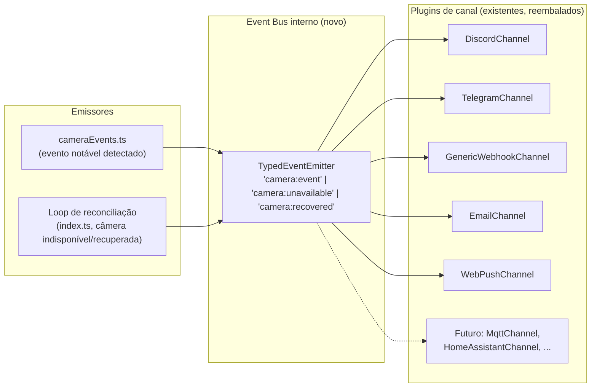

# 04 — Event Bus interno e plugins de canal de notificação

> **Status: implementado.** Ver `backend/src/notifications/channel.ts`,
> `registry.ts`, os adapters em `discord.ts`/`telegram.ts`/
> `genericWebhook.ts`/`email.ts`/`webPushChannel.ts`, e `events/bus.ts`.

**Prioridade**: Média · **Esforço**: S/M · **Depende de**: nada · **Independente** das demais fases (pode ser feito em paralelo)

## Motivação

Da conversa com o ChatGPT: *"Hoje eu faria todos os eventos passarem por um
barramento... Qualquer módulo poderia assinar esses eventos... Isso facilita
plugins."* e a ideia de *"Plugin SDK"* com `telegram/`, `mqtt/`, `plate/`,
`face/`, `homeassistant/` como módulos plugáveis.

Confirmado em [00](./00-estado-atual-e-dores.md#5-canais-de-notificação-convenção-não-interface-formal):
os 5 canais atuais (Discord, Telegram, webhook genérico, e-mail, web push) já
têm formato **quase** idêntico, mas sem `interface` comum nem registro
dinâmico — adicionar um canal novo exige editar `webhooks.ts` em 3 lugares.
Esta fase é uma formalização de algo que já existe por convenção, não uma
reescrita.

## Desenho proposto

**Não introduzir um message broker externo** (Redis/RabbitMQ/MQTT broker) —
seria over-engineering para o tamanho do projeto e adicionaria uma
dependência de infraestrutura nova só para comunicação *dentro do mesmo
processo Node*. Em vez disso, usar o módulo `events` nativo do Node
(`EventEmitter`), tipado via um wrapper fino.



### Interface comum

```ts
// backend/src/notifications/channel.ts
export interface NotificationEvent {
  kind: "camera_event" | "camera_unavailable" | "camera_recovered" | "test";
  camera: PublicCamera;
  message: string;
  snapshot?: Buffer | null;
  recordingLink?: string | null;
  snapshotUrl?: string | null;
  clip?: Buffer | null;
  caption?: string | null;
}

export interface NotificationChannel {
  readonly id: string; // "discord" | "telegram" | ...
  isEnabled(settings: NotificationSettings): boolean;
  send(event: NotificationEvent, settings: NotificationSettings): Promise<void>;
}
```

Cada canal existente vira um objeto que implementa essa interface,
literalmente envolvendo a função já existente (`notifyDiscord`, etc.) — sem
reescrever a lógica de envio em si, só o ponto de entrada. Um registro
simples:

```ts
// backend/src/notifications/registry.ts
export const channels: NotificationChannel[] = [
  discordChannel, telegramChannel, genericWebhookChannel, emailChannel, webPushChannel,
];
```

`webhooks.ts` deixa de chamar cada canal por nome; passa a iterar
`channels.filter(c => c.isEnabled(settings))` com `Promise.allSettled` — o
comportamento de "uma falha não bloqueia outra" já existente é preservado, só
muda de "5 chamadas hardcoded" para "iteração sobre lista".

## Passos concretos

1. Criar `backend/src/notifications/channel.ts` com a interface
   `NotificationChannel`/`NotificationEvent` acima.
2. Envolver cada canal existente (`discord.ts`, `telegram.ts`,
   `genericWebhook.ts`, `email.ts`, `webPush.ts`) em um pequeno adapter que
   implementa a interface, **sem** alterar a lógica de envio interna de cada
   um (risco baixo — é só uma casca).
3. Criar `registry.ts` com a lista de canais.
4. Refatorar `webhooks.ts::notifyEvent` /
   `notifyCameraUnavailable`/`notifyCameraRecovered`/`sendTestNotification`
   para iterar o registro em vez de chamar cada função por nome.
5. (Opcional, mas barato) Criar um `EventEmitter` tipado simples
   (`backend/src/events/bus.ts`) só para desacoplar quem *dispara* o evento
   (`cameraEvents.ts`, loop de reconciliação) de quem *consome*
   (`webhooks.ts` hoje; qualquer plugin futuro depois) — isso é o que
   permite, no futuro, adicionar um canal MQTT/Home Assistant sem tocar em
   `cameraEvents.ts` nem em `webhooks.ts`, só registrando um novo listener.
6. Testes: os adapters são triviais de testar isoladamente
   (`isEnabled`/`send` chamando um mock de fetch), mais fácil do que testar
   `webhooks.ts` monolítico como é hoje.

## Critérios de aceite

- Comportamento observável idêntico ao atual para os 5 canais existentes
  (mesmos payloads, mesmos endpoints, mesmo comportamento de "falha
  isolada").
- Adicionar um canal de exemplo (pode ser fictício/apenas para prova de
  conceito, ex. um `LogChannel` que só loga localmente) deve exigir **zero**
  edição em `cameraEvents.ts` e uma única linha nova em `registry.ts`.
- `npm test` do backend continua passando.

## Riscos / trade-offs

- É refatoração pura (sem feature nova visível ao usuário) — vale enquadrar
  como preparação para os próximos plugins (MQTT, Home Assistant, LPR),
  citados na conversa do ChatGPT, e não como entrega isolada de valor
  imediato.
- Cuidado para não introduzir um EventEmitter "global" mal tipado — usar
  genéricos/overloads para manter type-safety nos payloads de cada evento
  (evitar o clássico `emitter.on(name: string, listener: (...args: any[]) =>
  void)` sem tipos).
