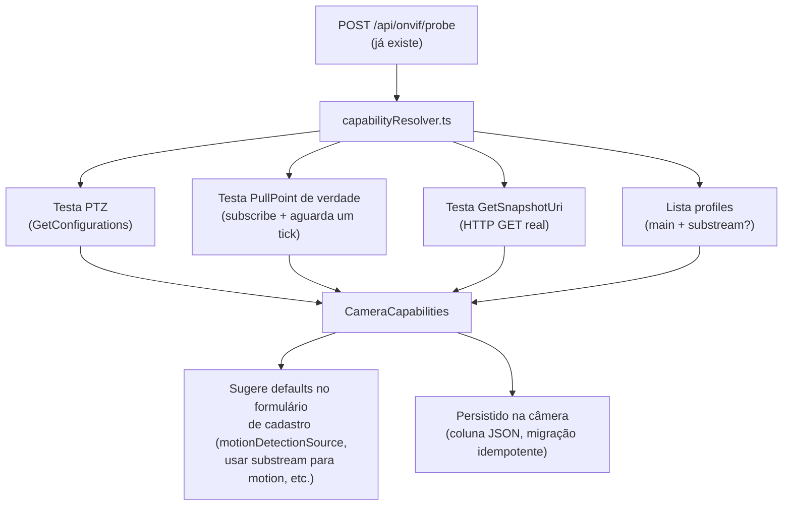

# 05 — Capability Resolver (abstração de recursos de câmera)

> **Status: implementado.** Ver `backend/src/onvif/capabilityResolver.ts`,
> coluna `capabilities` na tabela `cameras`, endpoints de probe atualizados
> e `POST /api/cameras/:id/capabilities/resolve`, badges + botão
> "Redetectar capacidades" no `CameraFormDialog.tsx`.

**Prioridade**: Baixa/Média · **Esforço**: M · **Depende de**: nada · **Beneficia** especialmente câmeras ONVIF baratas/incompletas (ex. Yoosee, citadas na sua conversa original)

## Motivação

Da conversa com o ChatGPT: *"Você comentou que sofre bastante com câmeras
Yoosee e ONVIF incompleto... Eu faria um módulo chamado Capability Resolver.
Ele detectaria automaticamente: PTZ, Snapshot, Metadata, ONVIF Events, RTSP,
Substream, Áudio, Codecs. E geraria uma interface única para o restante do
sistema."*

Hoje essa lógica já existe, mas **espalhada** por vários módulos e por
flags manuais no cadastro da câmera (`sourceType`, `rtspCompatMode`,
`motionDetectionSource`, `hasPtz`, etc. em `cameras.repository.ts` e checados
individualmente em `provisioning.ts`, `motionOrchestrator.ts`,
`ptz.ts`/`ptzOrchestrator`). Funciona, mas cada novo caso especial de câmera
"esquisita" tende a virar mais um `if` espalhado em vez de uma capacidade
detectada e registrada uma vez.

## Estado atual (o que já existe, para não reinventar)

- `sourceType` já distingue onvif/rtsp/rtmp/hls/srt/mjpeg-http/webpage.
- `rtspCompatMode: "vlc-relay"` já é uma forma (manual, configurada pelo
  usuário) de lidar com câmeras cujo servidor RTSP o cliente Go do MediaMTX
  não consegue falar corretamente.
- `hasPtz` já existe e já é usado para decidir se `warmPtzConnection` roda.
  `motionDetectionSource` já escolhe entre ONVIF PullPoint e detecção por
  vídeo.
- **O que falta**: nada disso é hoje o resultado de uma *sondagem automática*
  centralizada — são flags que o usuário define manualmente (ou o backend
  assume por padrão), e cada consumidor consulta o campo que precisa
  diretamente do registro da câmera, sem uma camada de abstração única.

## Desenho proposto

Um módulo `backend/src/onvif/capabilityResolver.ts` que, na hora do
cadastro/probe de uma câmera ONVIF (reaproveitando o fluxo que já existe em
`POST /api/onvif/probe`), tenta ativamente:

1. Consultar `GetCapabilities`/`GetServices` ONVIF (parte disso já é feito
   implicitamente pelo `node-onvif` ao conectar).
2. Testar se o PullPoint de eventos responde de verdade (não só se o serviço
   está anunciado — câmeras baratas anunciam suporte a eventos que não
   funcionam de verdade na prática, um problema já documentado na memória do
   repo sobre ONVIF PullPoint).
3. Testar se `GetSnapshotUri` retorna uma URL que de fato responde 200 com
   uma imagem válida (não só se o método SOAP não deu erro).
4. Verificar se existe um profile de substream (resolução menor) além do
   principal.
5. Consolidar tudo em um objeto único:

```ts
export interface CameraCapabilities {
  ptz: boolean;
  onvifEventsWork: boolean;    // não só "anunciado", mas testado de verdade
  snapshotWorks: boolean;      // testado com request real
  hasSubstream: boolean;
  audio: boolean;
  videoCodec: string | null;
  probedAt: number;
}
```

6. Persistir esse resultado junto ao registro da câmera (nova coluna/JSON,
   seguindo o padrão de migração idempotente já usado em `client.ts`), e
   **usar esse resultado para pré-selecionar defaults sensatos** no momento
   do cadastro (ex.: se `onvifEventsWork === false`, sugerir automaticamente
   `motionDetectionSource: "video"` em vez de deixar o usuário descobrir isso
   na prática depois de configurar errado).



## Passos concretos

1. Criar `capabilityResolver.ts` com uma função
   `resolveCapabilities(onvifUrl, credentials): Promise<CameraCapabilities>`
   — cada teste deve ser **best-effort e independente** (uma falha em testar
   PTZ não deve impedir de testar snapshot), seguindo a filosofia já
   estabelecida no projeto ("best-effort, nunca lança").
2. Adicionar coluna `capabilities` (JSON, nullable) na tabela `cameras` via
   `applyColumnMigrations` (padrão já usado em `client.ts`).
3. Rodar o resolver: (a) no momento do probe/cadastro inicial, exibindo o
   resultado como informação na tela de cadastro; (b) opcionalmente, um botão
   manual "redetectar capacidades" na tela de edição de câmera, para quando o
   firmware da câmera mudar.
4. Frontend: exibir os resultados testados na tela de cadastro/edição (ex.
   badges "PTZ ✓", "Eventos ONVIF ✗ (usar detecção por vídeo)", "Snapshot
   direto ✓") — e usar `onvifEventsWork` para sugerir automaticamente
   `motionDetectionSource: "video"` quando `false`.
5. **Não** remover nenhuma flag manual existente — o resolver só preenche
   defaults sugeridos; o usuário sempre pode sobrescrever manualmente (mesma
   filosofia de hoje, só com melhor ponto de partida).

## Critérios de aceite

- Cadastrar uma câmera ONVIF com PullPoint que não funciona de verdade (caso
  real documentado na memória do repo) resulta em `motionDetectionSource`
  sugerido automaticamente como `"video"`, sem o usuário precisar descobrir
  isso na prática por tentativa e erro.
- Nenhuma regressão em câmeras já cadastradas (a migração adiciona a coluna
  como nullable; câmeras existentes simplesmente não têm capacidades
  resolvidas até serem re-testadas manualmente).

## Riscos / trade-offs

- Testar PullPoint "de verdade" (assinar e esperar) adiante do cadastro pode
  adicionar alguns segundos de latência ao fluxo de probe — deve ser feito
  com timeout curto e de forma assíncrona/não bloqueante (o cadastro não deve
  esperar o teste completo para salvar a câmera).
- Câmeras podem mudar de comportamento após atualização de firmware — por
  isso o botão manual de "redetectar", não só a sondagem única no cadastro.
