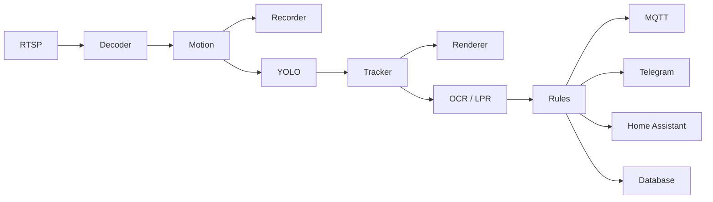

# 06 — Graph Pipeline visual (visão de longo prazo, aspiracional)

**Prioridade**: Aspiracional (não é compromisso de implementação) · **Esforço**: L/XL · **Depende de**: fases 01-04 idealmente já em produção e estáveis

## Motivação

Este item vem diretamente da parte final da conversa com o ChatGPT — a ideia
mais ambiciosa levantada: *"Eu abandonaria a ideia de 'plugin de IA' e
passaria a usar o conceito de Graph Pipeline... o usuário montar
visualmente... Cada bloco seria um plugin conectado por portas de entrada e
saída, semelhante ao GStreamer ou ao Node-RED, mas especializado para
vídeo."*

Este documento existe para **registrar a ideia e não perdê-la**, não para
comprometer o roadmap com ela. É explicitamente a fase de menor prioridade
de todo o plano.

## Por que não priorizar agora

- É essencialmente reescrever a camada de orquestração de eventos/IA como um
  motor de grafo genérico (nós, portas, edges, execução) — ordem de grandeza
  muito maior que qualquer outra fase deste roadmap.
- As fases 01-04 já entregam a maior parte do valor prático mencionado na
  conversa (frame compartilhado, tracking, overlay, plugins de notificação)
  **sem** precisar de um editor visual de grafo — o "plugin" já vira uma
  função registrada num array (fase 04), o que cobre 90% da necessidade de
  extensibilidade com 10% do esforço.
- Um editor visual de pipeline é, na prática, um produto à parte (é o que
  Node-RED e o próprio GStreamer resolvem) — antes de construir isso, vale
  validar se as fases anteriores já não resolvem a dor real.

## Esboço de como seria (só para referência futura)

Cada bloco receberia/produziria um contrato de dados comum (equivalente ao
"Frame" enriquecido incrementalmente, mencionado na conversa: `objects[]`,
`tracks[]`, `overlays[]`, `metadata{}`), e o "grafo" seria configurável pelo
usuário via UI, análogo a Node-RED, mas com nós especializados em vídeo.

## Pré-requisitos antes de sequer considerar isso

1. Fases 01-04 implementadas e validadas em uso real por um tempo.
2. Evidência concreta de que usuários (ou você mesmo) sentem falta de
   compor pipelines livremente, além do que a extensão via `registry.ts`
   (fase 04) já permite.
3. Decisão explícita de que o OpenDVR quer virar uma "plataforma" (like
   Node-RED for video) em vez de "um DVR com IA boa" — são objetivos de
   produto diferentes, vale decidir isso conscientemente antes de investir
   aqui.

## Status

Não iniciar nenhum trabalho de código para esta fase até as fases 01-04
estarem concluídas e o item 3 acima ser decidido explicitamente.
