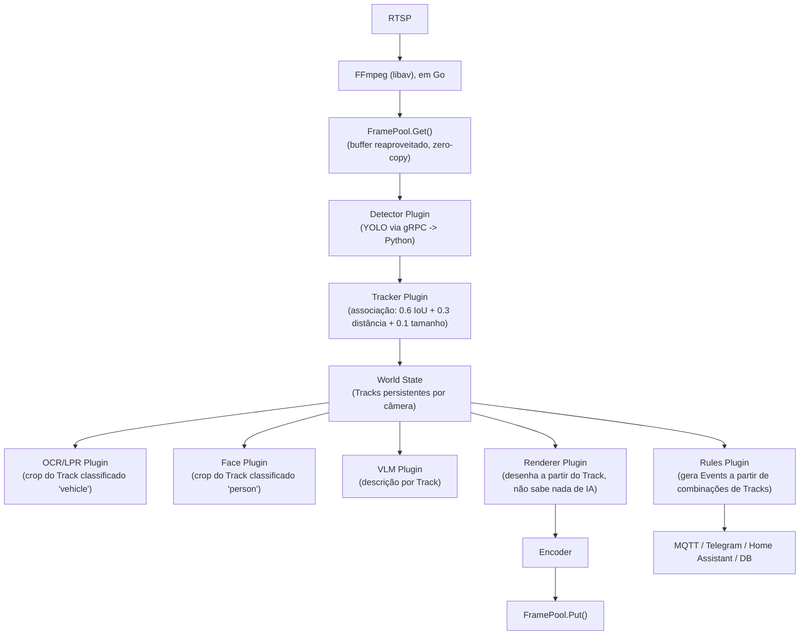

# 07 — Núcleo em Go, FramePool e modelo ECS (visão de longo prazo, aspiracional)

**Prioridade**: Aspiracional (não é compromisso de implementação) · **Esforço**: XL · **Fonte**: [conversa 2 no ChatGPT](https://chatgpt.com/share/6a6f56da-1134-83e9-8fd1-cb353f2212b1) · **Relação com a [Fase 06](./06-graph-pipeline-futuro.md)**: são as duas visões "grandes" registradas para não se perderem; esta é mais radical (reescrita de núcleo), a 06 é mais sobre o pipeline visual em cima do sistema atual.

## Motivação

A segunda conversa com o ChatGPT aprofunda a ideia de Frame Bus da primeira
conversa e propõe algo mais radical: **um núcleo de mídia inteiro em Go**,
com um `FramePool` (buffers reutilizados, zero-copy), onde Python deixa de
tocar vídeo e vira só mais um "plugin de visão" via gRPC. A peça central da
proposta não é mais o Frame — é o **Track**: um modelo estilo *Entity
Component System* (ECS, comum em game engines), onde cada objeto detectado
numa câmera é uma entidade persistente que vai sendo enriquecida por
plugins sucessivos (detecção → classificação → tracking → OCR → face → VLM →
regras), em vez de cada plugin processar frames isolados.

> Citação direta da conversa: *"Se eu pudesse redesenhar a arquitetura hoje,
> eu não faria um 'pipeline de vídeo'. Eu faria um motor de entidades, muito
> parecido com um game engine (...) Isso é, na prática, um Entity Component
> System (ECS) aplicado a vídeo."*

## O modelo proposto (resumo fiel à conversa)

```go
type World struct {
    Tracks map[uint64]*Track
}

type Track struct {
    ID         uint64
    Class      ObjectClass
    BBox       Rect
    Confidence float32
    FirstSeen  time.Time
    LastSeen   time.Time
    Velocity   Vector
    Metadata   map[string]any // placa, nome do rosto, descrição do VLM, etc.
}

type Frame struct {
    Buffer  []byte // reutilizado via FramePool, nunca realocado por plugin
    Width, Height int
    Format  PixelFormat
    Objects []Object
    Tracks  []Track
    Events  []Event
}

type Plugin interface {
    Name() string
    Priority() int
    Process(*Frame) // ou, na versão mais refinada da conversa, Process(*Track)
}
```

Pipeline conceitual:



Pontos centrais da proposta, fielmente resumidos:

1. **Frame imutável, exceto pelos campos de anotação** (`objects`, `tracks`,
   `overlays`, `metadata`) — a imagem (`buffer`) nunca é reescrita por um
   plugin de análise; só o `Renderer` (o último estágio) efetivamente desenha
   em cima dela, uma única vez.
2. **Plugins processam `Track`, não `Frame`** — "a maior sacada" da conversa:
   um frame pode conter várias pessoas/veículos/animais; cada `Track` segue
   seu próprio caminho pelos plugins (OCR só roda em tracks `vehicle`, face
   só em tracks `person`), em vez de cada plugin reprocessar o frame inteiro
   procurando o que lhe interessa.
3. **Tracking por associação, não por rede neural extra** — mesmo algoritmo
   já incorporado na [Fase 02](./02-tracking-de-objetos.md#desenho-proposto)
   deste roadmap (score `0.6·IoU + 0.3·distância + 0.1·tamanho`, sem Hungarian
   Algorithm para até ~50 objetos por câmera, Kalman como refinamento
   opcional depois).
4. **Python vira só um "Vision Plugin" via gRPC** — nunca mais abre RTSP,
   nunca mais renderiza, só recebe um buffer RGB/YUV cru e devolve metadata
   JSON (`{"tracks": [{"id":15, "bbox":[...], "class":"person"}]}`).
5. **Renderer em Go, sem OpenCV** — a conversa sugere bibliotecas puras Go
   (`fogleman/gg`, `freetype`, `draw2d`) para desenhar bounding boxes/labels,
   evitando trazer OpenCV para a camada de renderização.
6. **`Capability Plugins`, não "workers" por nome de IA** — em vez de
   `motion_worker`/`vision_worker`/`ocr_worker` como hoje, uma pasta
   `plugins/{detector,tracker,classifier,ocr,face,renderer,rules,mqtt,
   telegram,storage}/`, todos implementando a mesma interface `Plugin`.

## Por que isto é registrado como aspiracional (não priorizado)

- É uma **reescrita completa da camada de mídia**, trocando a linguagem do
  núcleo de TypeScript/Node para Go — ordem de grandeza muito maior que
  qualquer fase 01-05, e maior até que a fase 06 (que mantém o stack atual).
- O ganho de performance real (zero-copy, buffers reutilizados) só importa
  na escala de "processar todo frame de todo stream continuamente" — o
  OpenDVR de hoje **não** faz isso (só processa frames pontuais disparados
  por movimento), então boa parte do ganho de um `FramePool` não se aplica
  ao modelo de uso atual sem *também* decidir processar vídeo continuamente
  (uma mudança de produto grande por si só).
- As ideias de maior valor prático e mais baratas de obter **já foram
  extraídas e incorporadas nas fases incrementais**: o algoritmo de tracking
  por associação (fase 02), o padrão de recorte antes de OCR/face (nota na
  fase 02), o Renderer como estágio separado (fase 03), e plugins de
  notificação desacoplados (fase 04) — sem precisar trocar de linguagem nem
  reescrever a ingestão de vídeo.
- Uma reescrita de núcleo em Go implica também reescrever toda a integração
  com MediaMTX, ONVIF, gravação e a própria API/DB hoje em Node — ou rodar
  dois núcleos em paralelo (Go para mídia, Node para o resto), o que é
  viável mas é uma decisão de arquitetura de produto, não um refactor.

## Se um dia isto for reconsiderado

Pré-requisitos antes de sequer prototipar:

1. Fases 01-05 implementadas, e evidência real (não hipotética) de que o
   gargalo de CPU do stack atual (Node + Python) é o decode/cópia de frames
   em si, e não outra coisa (rede, disco, modelo de IA lento).
2. Decisão consciente de que o OpenDVR passará a processar vídeo
   continuamente (não só em disparos de movimento) — sem isso, o
   `FramePool`/zero-copy não paga o custo de reescrita.
3. Apetite para manter dois runtimes de núcleo (Go + Node) ou migrar tudo,
   incluindo ONVIF/API/DB — ambos são projetos grandes por si só.

## Status

Nenhum trabalho de código para esta fase. Registrado unicamente como
referência de visão de longo prazo, para não perder o raciocínio da conversa
caso um dia a decisão de reescrever o núcleo seja tomada conscientemente.
