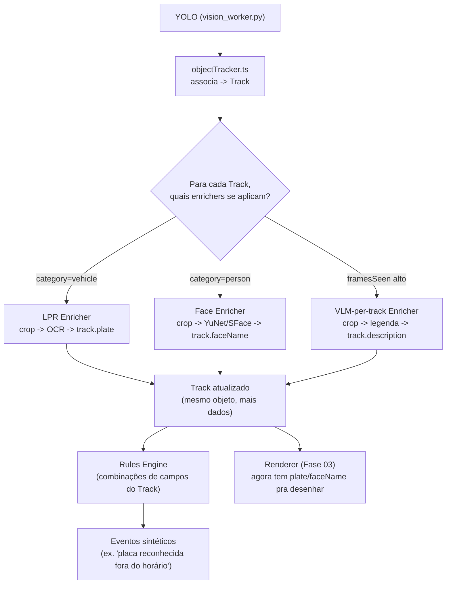

# 08 — Track enriquecível (mini-ECS), OCR/LPR, rosto por recorte e motor de regras

> **Status: planejamento apenas, nada implementado.** Este documento responde
> à pergunta "já fazemos isso?" feita após uma terceira leitura de conversa
> com o ChatGPT (tracking de pessoas/animais/veículos/objetos, OCR de placa,
> EPIs, objetos abandonados, modelo ECS de `Track` com componentes) e propõe
> um caminho incremental — **não** a reescrita em Go da [Fase
> 07](./07-nucleo-go-framepool-ecs-futuro.md), que continua sendo a rota mais
> radical e não priorizada.

## Resposta direta: já fazemos isso?

**Parcialmente.** As Fases 01-05 (todas já implementadas) cobrem boa parte da
base necessária, mas o "motor de entidades" (World State / ECS completo)
descrito na conversa **não existe** — o que temos hoje é um tracker simples e
**efêmero** (vive só durante uma sessão de evento), não um `Track` persistente
que vários plugins vão enriquecendo ao longo do tempo. Tabela ponto a ponto:

| Recurso pedido na conversa | Situação hoje | Onde / detalhe |
|---|---|---|
| Tracking de pessoas/veículos/animais/objetos com ID estável | ✅ Parcial | [Fase 02](./02-tracking-de-objetos.md): `objectTracker.ts` já associa detecções por score (IoU+centro+tamanho) e dá `trackId` estável — **mas é efêmero**: `clearTracks()` roda ao fim de cada sessão de evento (`cameraEvents.ts`), não existe conceito de "esse é o mesmo cachorro que passou ontem". |
| Classificação específica (dog/cat/car/bicycle, não só "animal"/"vehicle") | ✅ Já temos o dado, ❌ não exposto | `vision_worker.py` já retorna `label` com a classe COCO exata (ex. "dog", "bicycle") além da `category` agregada — esse `label` já flui até o banco (`pipelineOutputs`) e até é desenhado no snapshot anotado (Fase 03), mas **a tela de Eventos só mostra a `category` agregada**, o `label` específico só aparece no JSON bruto expandido. |
| EPIs (capacete, colete) | ❌ Não temos | COCO/YOLO não tem essas classes - exigiria modelo customizado/fine-tuned, fora do escopo de qualquer fase atual. |
| OCR / leitura de placa (LPR) | ❌ Não temos | Nenhum código de OCR existe hoje. `vision_worker.py` só implementa `detect`/`face`/`embed_face`/`status`. |
| Reconhecimento facial | ✅ Parcial | Existe (YuNet+SFace, `vision_worker.py`'s task `face`), mas roda no **frame inteiro**, não faz recorte a partir de um track `person` primeiro - o padrão "sempre recortar antes do modelo caro" foi só **documentado como nota** no plano da Fase 02, nunca implementado. |
| Descrição (VLM) por objeto individual | ✅ Parcial | Captioning (`captioning.ts`) já existe, mas é por **evento inteiro** (frame + hint agregado de detecções), não por `Track` individual ("Track 15 → 'homem de mochila azul'"). |
| Objetos abandonados | ❌ Não temos | Exigiria tracking de longo prazo (minutos/horas) de um objeto parado sem "dono" próximo - inviável com o tracker efêmero atual (que só vive dentro de uma sessão de evento, tipicamente segundos). |
| Regras compostas ("Pessoa + Veículo + Placa reconhecida + Fora do horário") | ❌ Não temos | Não existe motor de regras - cada evento é tratado isoladamente, sem correlação entre tracks/câmeras/horário. |
| Renderer "burro" que só lê o Track e desenha | ✅ Parcial | [Fase 03](./03-stream-anotada-renderer.md): `snapshotRenderer.ts` já desenha só a partir de `box`/`label`/`confidence`/`trackId` - não sabe nada de IA - mas só no **snapshot do evento**, não numa stream ao vivo (Entregável 2 da Fase 03, não implementado). |
| "Capability Plugins" com interface comum (detector/tracker/classifier/ocr/face/renderer/rules/mqtt/telegram/storage) | ✅ Parcial | [Fase 04](./04-event-bus-plugins.md) fez **exatamente isso**, mas só do lado de **saída/notificação** (`NotificationChannel` + `registry.ts`). Do lado de **percepção** (detector/tracker/ocr/face), tudo continua sendo chamadas diretas hardcoded em `objectDetection.ts` - não são plugins registráveis/substituíveis. |
| ECS completo (`Track` com componentes: BoundingBox/Motion/Classification/Plate/Face/OCR/Speed/Direction/Attributes/History/Events) | ❌ Não temos | O `Track` de hoje ([objectTracker.ts](../backend/src/media/objectTracker.ts)) tem só `{id, box, category, label, confidence, framesSeen, firstSeenAt, lastSeenAt}` - não é uma entidade extensível por múltiplos plugins, não acumula "componentes", não persiste História/Atributos além da sessão. |

**Resumo em uma frase**: já temos o *esqueleto* certo em vários pontos
isolados (tracker, renderer, registry de plugins de notificação, o dado
`label` específico já calculado) — o que falta é (1) tornar o `Track` **mais
duradouro e enriquecível por múltiplos passos**, (2) adicionar as duas
capacidades de IA que realmente não existem (OCR/LPR, face por recorte de
verdade), e (3) um motor de regras simples para combinações. Não é preciso
reescrever nada em Go para isso — dá para evoluir o `objectTracker.ts` atual.

## Desenho proposto: "mini-ECS" em Node, sem trocar de stack

Em vez do `World struct { Tracks map[uint64]*Track }` em Go da conversa,
propomos o equivalente em TypeScript, vivendo no mesmo `objectTracker.ts` já
existente, com dois ajustes centrais:

1. **Track para de ser efêmero (por sessão) e passa a ter uma janela de vida
   mais longa** (ex. alguns minutos após o último avistamento, não só até o
   fim da sessão de evento) - permitindo que um OCR/Face/VLM rodem em passos
   *seguintes* sobre o *mesmo* track, não só no instante da detecção.
2. **Track ganha um saco de componentes opcionais**, preenchidos por funções
   independentes ("enrichers"), no mesmo espírito do `NotificationChannel`
   da Fase 04:

```ts
export interface Track {
  id: number;
  category: ObjectDetection["category"];
  label: string;              // já existe hoje
  box: Box;
  confidence: number;
  firstSeenAt: number;
  lastSeenAt: number;
  framesSeen: number;
  // NOVO: componentes opcionais, cada um preenchido por um "enricher" IA
  // independente - nenhum enricher cria outro Track, só anexa dados.
  plate?: string;              // LPR
  faceName?: string | null;    // reconhecimento facial (recorte)
  description?: string;        // legenda VLM por track, não por evento
  attributes?: Record<string, unknown>; // extensível (cor, velocidade, etc.)
}

export interface TrackEnricher {
  readonly id: string;             // "lpr" | "face" | "vlm-per-track" | ...
  appliesTo(track: Track): boolean; // ex.: category === "vehicle" para LPR
  enrich(track: Track, frame: Buffer): Promise<void>;
}
```

Um `enrichers.ts` (mesmo padrão do `registry.ts` da Fase 04) listaria os
enrichers ativos; `objectDetection.ts` rodaria os aplicáveis a cada track
depois da classificação normal, sem acoplamento direto.



## Sub-planos (cada um poderia virar uma fase própria, tipo 08a/08b/08c)

### 08a — OCR / Leitura de placa (LPR), padrão crop-first
- Pipeline: `YOLO categoriza "vehicle"` → `crop do bbox do veículo` → detector
  de placa (heurístico, ex. contornos retangulares com proporção típica de
  placa) OU um modelo leve dedicado → `crop da placa` → OCR.
- **Maior decisão em aberto**: qual motor de OCR. Opções realistas sem
  inflar demais o container: `tesseract.js` (puro JS/WASM, mas pesado e
  lento para vídeo) vs. um binário `tesseract-ocr` nativo via `child_process`
  (mais rápido, mas mais uma dependência de sistema no Dockerfile, no
  mesmo espírito do `ffmpeg`/`sharp` já usados) vs. um modelo ONNX dedicado
  de LPR (mais preciso para placas reais, mas precisa achar/treinar/vendorizar
  um modelo - problema parecido com o do YOLO, que já não é vendorizado por
  licença).
- Roda como uma nova task no `vision_worker.py` (`task: "ocr"`), reaproveitando
  o processo compartilhado já existente - **não** um "OCR Worker" separado
  (evita repetir o erro que a própria conversa aponta: "não deveria existir
  Motion Worker/Vision Worker/OCR Worker" como processos por nome de IA).

### 08b — Reconhecimento facial por recorte (não mais frame inteiro)
- Mudança menor: em vez de `detectFaces(frameJpeg)` rodar no frame inteiro,
  recortar a região do `track` já classificado como `person` antes de chamar
  YuNet/SFace. Reduz custo (imagem menor) e melhora precisão (menos fundo
  pra confundir o detector).
- Puramente uma otimização/qualidade - não muda o resultado exposto
  (`faceName`), só como ele é calculado.

### 08c — Motor de regras simples (combinações de campos do Track)
- Um `rules.ts` avaliando expressões simples tipo
  `category === "vehicle" && plate !== undefined && isAfterHours()` contra
  cada `Track` atualizado, gerando um evento sintético novo (reaproveitando
  o pipeline de eventos já existente) quando uma regra bate.
- Regras configuráveis pelo usuário (Settings) ficam fora do MVP - começar
  com regras fixas/código, exposição de configuração é um refinamento
  posterior.

### 08d — Track de vida mais longa + Renderer/VLM por track
- Estende `TRACK_TTL_MS` da Fase 02 (hoje alinhado à sessão de evento, ~20s)
  para um valor configurável maior quando um enricher está pendente,
  permitindo que LPR/Face/VLM rodem sobre o mesmo track em vez de um novo.
- Alimenta diretamente o Entregável 2 da Fase 03 (stream anotada ao vivo,
  ainda não implementado) - agora com `plate`/`faceName` disponíveis pra
  desenhar, não só `category`/`label`.

## Por que isso NÃO é a Fase 07 (núcleo em Go)

Tudo acima é implementável **em cima do `objectTracker.ts` e
`vision_worker.py` que já existem**, sem trocar de linguagem nem reescrever
a ingestão de vídeo. A Fase 07 continua sendo a aposta "e se quiséssemos
zero-copy/ECS de verdade, em Go" - esta Fase 08 é a versão "quanto do valor
da conversa dá pra capturar sem sair do stack atual", e a resposta é: a
maior parte dele.

## Riscos / decisões em aberto (por isso é só planejamento por ora)

1. **OCR é a maior incógnita de custo/precisão** - motor a escolher (WASM vs
   binário nativo vs modelo dedicado), e placas brasileiras (Mercosul) têm
   padrão visual específico que pode exigir ajuste fino além de um OCR
   genérico.
2. **Objetos abandonados e EPIs ficam fora do MVP** desta fase - o primeiro
   exige um design de "detecção de ausência de dono" mais elaborado, o
   segundo exige um modelo customizado que este projeto não tem hoje
   (YOLO/COCO não cobre EPIs).
3. **Track de vida mais longa consome mais memória** (por câmera, por
   track) - precisa de um limite razoável de tracks simultâneos e expiração
   agressiva mesmo assim.
4. Nenhuma dessas sub-fases foi validada com o usuário como prioridade real
   de produto ainda - este documento é só a resposta à pergunta "dá pra
   fazer sem reescrever tudo", não um compromisso de implementação.
