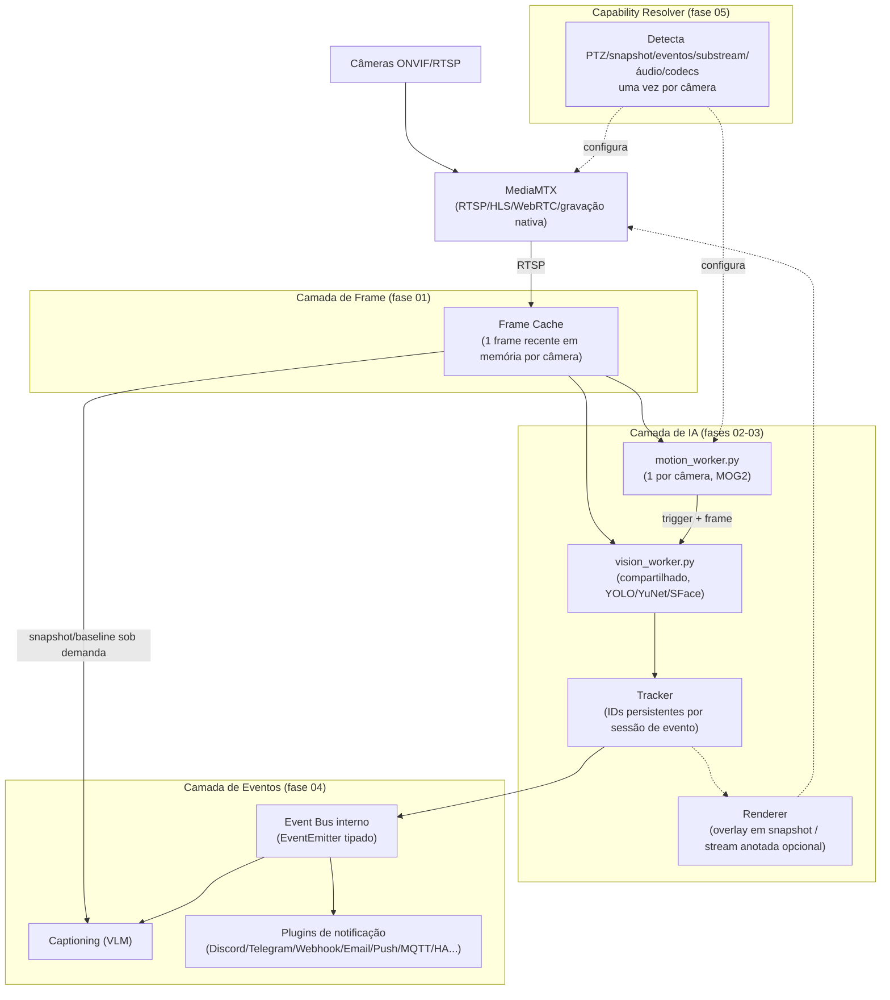

# OpenDVR — Roadmap de arquitetura do pipeline de vídeo/IA

> Nota sobre as fontes: este roadmap foi construído a partir de duas
> conversas públicas com o ChatGPT —
> [conversa 1](https://chatgpt.com/share/6a6f52db-2250-83e9-80c6-ff8f3bd4e3e4)
> (Frame Bus, plugins, tracking, renderer, event bus — visão geral) e
> [conversa 2](https://chatgpt.com/share/6a6f56da-1134-83e9-8fd1-cb353f2212b1)
> (aprofundamento: algoritmos de tracking/associação, OCR/LPR e reconhecimento
> facial via recorte, e uma proposta mais radical de núcleo em Go com
> `FramePool`/modelo ECS — ver [fase 07](./07-nucleo-go-framepool-ecs-futuro.md))
> — combinadas com uma análise profunda e factual do código atual (ver
> [00-estado-atual-e-dores.md](./00-estado-atual-e-dores.md)). Um terceiro
> link (`chatgpt.com/c/...`) enviado antes era uma conversa privada e não pôde
> ser lido — se houver mais conteúdo relevante nela, cole o texto aqui ou
> gere um link `/share/`.

## Como usar esta pasta

Cada arquivo é uma fase/tema independente do roadmap, com: motivação, estado
atual (com referências exatas a arquivo/linha), desenho da arquitetura
proposta (Mermaid), passos concretos e critérios de aceite. A ideia é que
cada um possa ser implementado e mergeado isoladamente, sem depender de uma
reescrita completa do sistema — nada aqui exige "big bang".

| # | Documento | Tema | Prioridade | Esforço | Status |
|---|-----------|------|------------|---------|--------|
| 00 | [Estado atual e dores](./00-estado-atual-e-dores.md) | Baseline factual do pipeline hoje | — | — | — |
| 01 | [Frame Cache](./01-frame-cache.md) | Eliminar decodes/ffmpeg duplicados por câmera | Alta | M | ✅ Implementado |
| 02 | [Tracking de objetos](./02-tracking-de-objetos.md) | IDs persistentes entre frames, menos chamadas ao YOLO | Alta | M | ✅ Implementado |
| 03 | [Stream anotada / Renderer](./03-stream-anotada-renderer.md) | Overlays de bounding box em snapshot e (opcional) stream | Média | M/L | ✅ Entregável 1 implementado (Entregável 2 pendente) |
| 04 | [Event Bus e plugins de notificação](./04-event-bus-plugins.md) | Formalizar canais de notificação como plugins | Média | S/M | ✅ Implementado |
| 05 | [Capability Resolver](./05-capability-resolver.md) | Abstrair recursos de câmeras ONVIF/RTSP heterogêneas | Baixa/Média | M | ✅ Implementado |
| 06 | [Graph Pipeline (visão de longo prazo)](./06-graph-pipeline-futuro.md) | Pipeline visual estilo Node-RED/GStreamer | Aspiracional | L/XL | Não iniciado |
| 07 | [Núcleo em Go, FramePool e modelo ECS (visão de longo prazo)](./07-nucleo-go-framepool-ecs-futuro.md) | Reescrita radical do núcleo (Go, zero-copy, Track/World state) | Aspiracional | XL | Não iniciado |
| 08 | [Track enriquecível (mini-ECS), OCR/LPR, rosto por recorte, regras](./08-track-enriquecido-ocr-regras.md) | Evoluir o tracker atual em vez de reescrever (OCR/LPR, face por recorte, motor de regras) | Média/Baixa | M/L (por sub-fase) | Planejamento apenas |

## Princípios que guiam as decisões

1. **Incremental, não big-bang.** O OpenDVR é mantido por uma pessoa e roda em
   hardware doméstico (às vezes só CPU). Cada fase deve entregar valor sozinha
   e ser revertível.
2. **MediaMTX continua sendo a única fonte de verdade para RTSP/HLS/gravação.**
   Nenhuma fase aqui propõe o backend Node ou os workers Python passarem a
   fazer ingestão/transcodificação primária — isso continua 100% no MediaMTX.
3. **CPU é o recurso mais escasso.** Qualquer proposta que aumente o número de
   decodes de vídeo por câmera precisa justificar o ganho (ex.: tracking pode
   *reduzir* chamadas ao YOLO, então paga a própria conta).
4. **"Melhor o simples que funciona hoje do que o ideal que nunca sai do
   papel."** O item 06 (graph pipeline visual) é registrado porque apareceu na
   conversa do ChatGPT como uma visão de produto interessante, mas é
   explicitamente marcado como aspiracional/baixa prioridade — não é um
   compromisso de implementação.
5. Sem estimativas de tempo/calendário — apenas prioridade relativa (Alta/
   Média/Baixa) e tamanho de esforço relativo (S/M/L/XL).

## Diagrama: visão geral do alvo (todas as fases combinadas)

